## 발표자 소개

- 김형준 (kim@mindscale.kr)
- 서울대학교 인류학 / 심리학 학사
- 서울대학교 인지과학 석사

### (현)
- (주)퀀트랩 Analytic Director  
- [온오프라인 R 교육](http://course.mindscale.kr/course/text-analysis)
- 기업 데이터 분석 및 컨설팅  

### (전)
- 품질 / 클레임 / 인사 데이터 분석  
- 홈페이지 및 서버 관리

--- .new-background

## 회사 소개

<center></center>

--- .new-background

## 나에게 R이란?

<h4></br></h4>
<h4></br></h4>

<h3b> 1. 통계 프로그램 : 모형화 / 예측  </h3b>  
<h3b> 2. 시각화 도구 : ggplot2 / Web과 연동 </h3b>     
<h3b> 3. 발표 자료 도구 : slidify   </h3b>  
<h3b> 4. 언어 처리 도구 : 텍스트 분석   </h3b>  
<h3b> 5. Matlab / Python -> R </h3b>  

- 본 발표자료는 Interactive Plots이 포함되어 있습니다. [클릭하세요](http://soeque1.github.io/RUCK2015/html/kim_quantlab.html#1)

--- .new-background

## 텍스트 분석

### 텍스트 분석 목적  
: 사람들은 생각과 감정을 언어로 표현합니다. 뉴스 댓글, 상품평, 커뮤니티, SNS 등에 사람들이 남기는 텍스트를 모아서 분석해보면 기존의 방법론으로 알기 어려웠던 여러 가지 정보를 얻을 수 있습니다.

### 감정 분석 목적
: 특정 키워드(이미지, 제품 등)에 대한 감정을 점수화하여 별도의 여론 조사 없이 감정의 정도를 예측할 수 있습니다. 또한, 감정의 이유를 분석하여 부정적인 요소를 개선할 수 있습니다.

### 통계 분석 목적 
: 주어진 데이터를 통해 미래를 예측 + 통계 모형을 통해 현상을 설명  

--- &twocol w1:40% w2:60% .new-background

## 분석 예시 - Text

*** =left

### 최초의 텍스트 분석

<h4></br></h4>

형태소 분석기  
- 형태소 분석기 KLT2000 (강승식)  

R  
- wordcloud  
- shiny  

결과
- 신축 기숙사 공용 공간 확대  
- 기존 기숙사 흡연 구역 재배정  

*** =right
<left></left>

--- &twocol w1:50% w2:50% .new-background

## 대통령 취임사 [Shiny](https://soeque1.shinyapps.io/wordcloud/)

*** =left
### 박근혜 - 노무현
<left>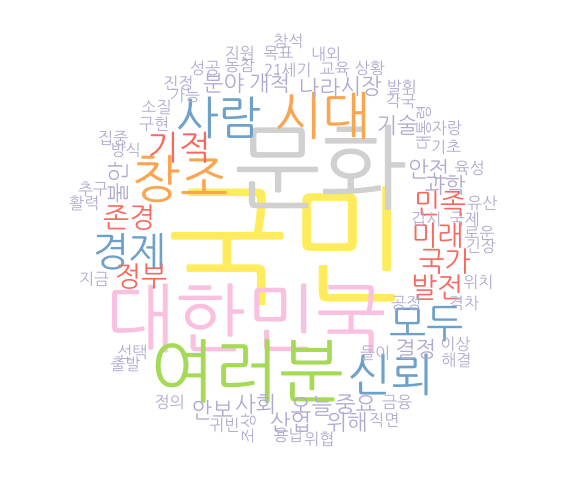</left>

*** =right
### 노무현 - 박근혜
<left>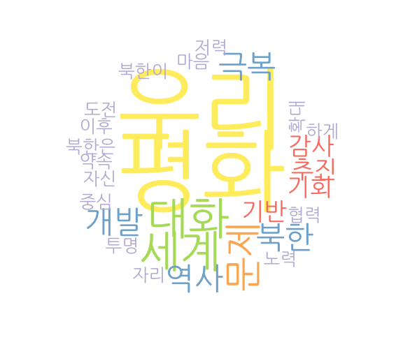</left>

--- &twocol w1:50% w2:50% .new-background

## 영화 이미테이션 게임 & 베네딕트 

*** =left
<center></center>

*** =right
<center></center>


--- &twocol w1:50% w2:50% .new-background

## 분석 예시 - Text

*** =left
<center></center>

*** =right
<center>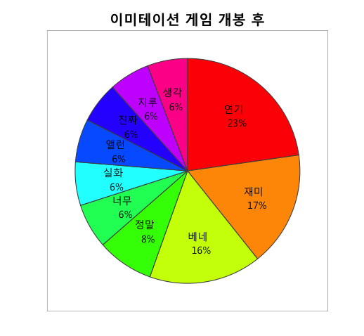</center>

--- &twocol w1:50% w2:50% .new-background

## 텍스트와 감정

*** =left
<center></center>

*** =right

<h4></br></h4>
<h4></br></h4>

```{r, eval=F}
library(KoNLP) 
library(tm)
library(qgraph)
```

한국어 감정사전  
불필요(stopwords) 단어사전  

```{r results="asis", echo=F, fig.width=6}
실망 = c("허접", "3d", "4d", "cg빨", "기대")
지루 = c("초반", "산만", "전개", "감정", "전편")
```

```{r, eval=T}
실망
지루
```

--- &twocol w1:50% w2:50% .new-background

## 텍스트와 감정

*** =left

<center></center>

*** =right

<h4></br></h4>
<h4></br></h4>

```{r echo=F}
문제 = c('발생','차량','해결','방향','무관','상태','판단','동일', '소음', '엔진')
결함 = c('심각','리콜','기미','대형사고','머플러','목숨','앞바퀴','직관','확인','국토')
```

```{r results="asis", echo=T, fig.width=6}
문제
결함
```

--- &twocol w1:70% w2:30% .new-background

## 텍스트와 감정

*** =left

<div align="center">
<iframe width="1024" height="500"
src="http://soeque1.github.io/RUCK2015/html/assets/img/graph.html"  frameborder='0'>
    </iframe></div>

*** =right

<h4></br></h4>
<h4></br></h4>

```{r, eval=F}
library(networkD3) 
```

--- .dark .segue .nobackground

## How?

--- .new-background

## 필요한 것 

### 형태소 분석 및 단어 파싱
- tm / tau / NLP / openNLP
- KoNLP 

### 감정사전 

- [tm.plugin.sentiment](http://statmath.wu.ac.at/courses/SNLP/Presentations/DA-Sentiment.pdf)
- http://mpqa.cs.pitt.edu/lexicons/subj_lexicon/
- http://word.snu.ac.kr/kosac/
- http://clab.snu.ac.kr/arssa/doku.php?id=app_dict_1.0
- www.openhangul.com

--- .new-background

<style>
italic {
   font-style: italic;
}
</style>

## 사전 만드는 법

<h4></br></h4>

Dragut, E. C., Yu, C., Sistla, P., & Meng, W. (2010).  
Construction of a sentimental word dictionary.  
<italic> Paper presented at the Proceedings of the 19th ACM international conference on Information and knowledge management. </italic>  

<h4></br></h4>
<h4></br></h4>

Rao, Y., Lei, J., Wenyin, L., Li, Q., & Chen, M. (2014).  
Building emotional dictionary for sentiment analysis of online news.  
<italic> World Wide Web </italic>, 17(4), 723-742.

--- .new-background

## Workflow

<center>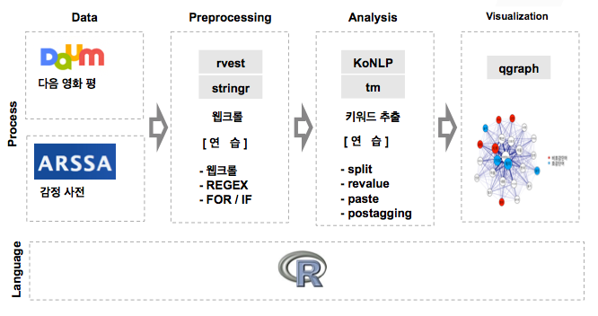</center>

--- &twocol w1:50% w2:50% .new-background

## 감정 점수 (tm.plugin.sentiment)

*** =left
<center></center>

*** =right
<center></center>

--- .new-background

## 감정 점수

<center>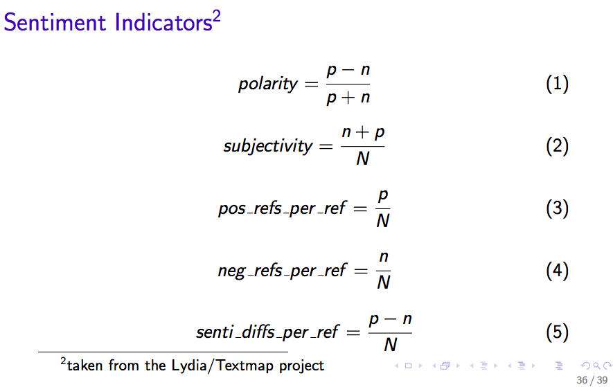</center>

- [출처 : Mario Annau(2010)](http://statmath.wu.ac.at/courses/SNLP/Presentations/DA-Sentiment.pdf)

--- .new-background

## 부정어 처리 (안, 않, 못)

<center>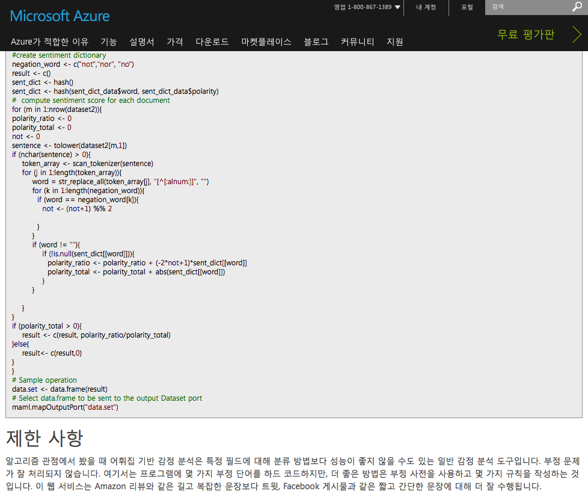</center>

--- .new-background

## 감정 점수

<center>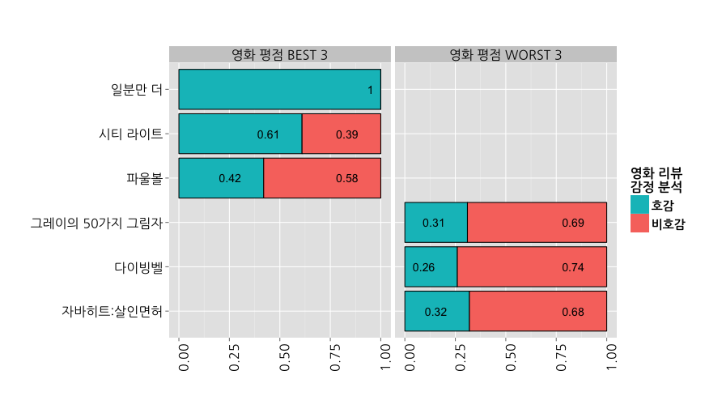</center>

--- .new-background

## 감정 점수

<center></center>

--- .new-background

## 감정 점수

<center>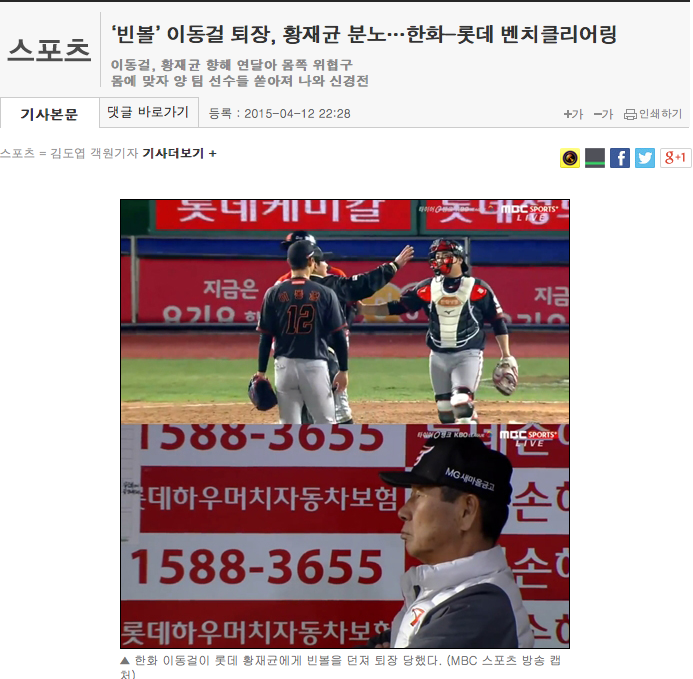</center>

--- .new-background

## 감정 점수

<center></center>

--- .new-background  .modal

## WHY?

```{r, echo=F}
bean.ball <- read.csv("/Users/kimhyungjun/Dropbox/repo/r_conference_2015/RUCK2015/data/bean_ball.csv") 
```

```{r, echo=F, eval=T}
bean.ball$x
```

---.new-background

<style>
italic {
   font-style: italic;
}
</style>

## Probabilistic Topic Models

### LDA  

Blei, David M. and Ng, Andrew and Jordan, Michael. (2003).  
Latent Dirichlet allocation.   
<italic>Journal of Machine Learning Research</italic>

[참고자료](http://yosinski.com/mlss12/media/slides/MLSS-2012-Blei-Probabilistic-Topic-Models.pdf)

---.new-background

## LDA

<center></center>

---.new-background

## LDA

<center>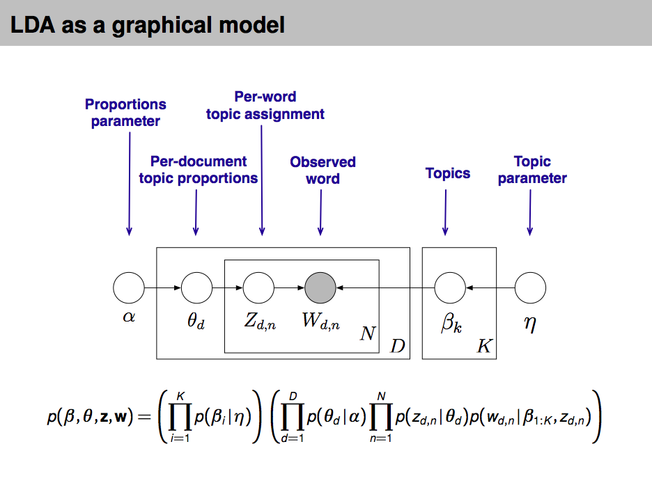</center>

---.new-background

## SLDA

<center></center>


--- &twocol w1:50% w2:50% .new-background

<style>
italic {
   font-style: italic;
}
</style>

## 대안

*** =left

### SLDA

Blei and McAuliffe, (2008).  
Supervised topic models.  
<italic> vances in Neural Information Processing Systems</italic>  
, pages 121–128. MIT Press.

### Cross-Validation

- Training Set과 Test Set을 7:3으로 분할

```{r}
library(lda)
library(topicmodels)
library(LDAvis)
library(servr)
```

*** =right

<h4></br></h4>
<h4></br></h4>

### 예측한 점수와 실제 점수간 상관관계


```{r, echo=F}
cor.resutls <- read.csv("/Users/kimhyungjun/Dropbox/repo/r_conference_2015/RUCK2015/data/naver_movie_cor.csv") 
```


```{r xtable2_1, results="asis", echo=F, fig.width=6}
library("xtable")
print(xtable(cor.resutls),type="html")
```

--- .dark .segue .nobackground

## Graph

--- .new-background

<div align="center">
<iframe width="1024" height="500" src="http://soeque1.github.io/RUCK2015/html/assets/slda/foulball/index.html#topic=9&lambda=0.51&term="  frameborder="0"">
</iframe></div>

--- .new-background

<div align="center">
<iframe width="1024" height="500" src="http://soeque1.github.io/RUCK2015/html/assets/slda/foulball/index.html#topic=7&lambda=0.51&term="  frameborder="0"">
</iframe></div>

--- .new-background

<div align="center">
<iframe width="1024" height="500" src="http://soeque1.github.io/RUCK2015/html/assets/lda/bobe/index.html#topic=4&lambda=.5&term="  frameborder="0"">
</iframe></div>


--- .new-background

<div align="center">
<iframe width="1024" height="500" src="http://soeque1.github.io/RUCK2015/html/assets/lda/bobe/index.html#topic=15&lambda=.5&term="  frameborder="0"">
</iframe></div>

--- .new-background

<div align="center">
<iframe width="1024" height="500" src="http://soeque1.github.io/RUCK2015/html/assets/lda/bobe/index.html#topic=18&lambda=.5&term="  frameborder="0"">
</iframe></div>

--- .new-background

<style>
italic {
   font-style: italic;
}
</style>

## Dynamic Topic Model

<center></center>
  
<h4></br></h4>
  
Blei, D. M., & Lafferty, J. D. (2006)  
Dynamic topic models. <italic> In Proceedings of the 23rd international conference on Machine learning. </italic> ACM.

--- &twocol w1:50% w2:50% .new-background

## A차종의 장점 요인

*** =left

<center>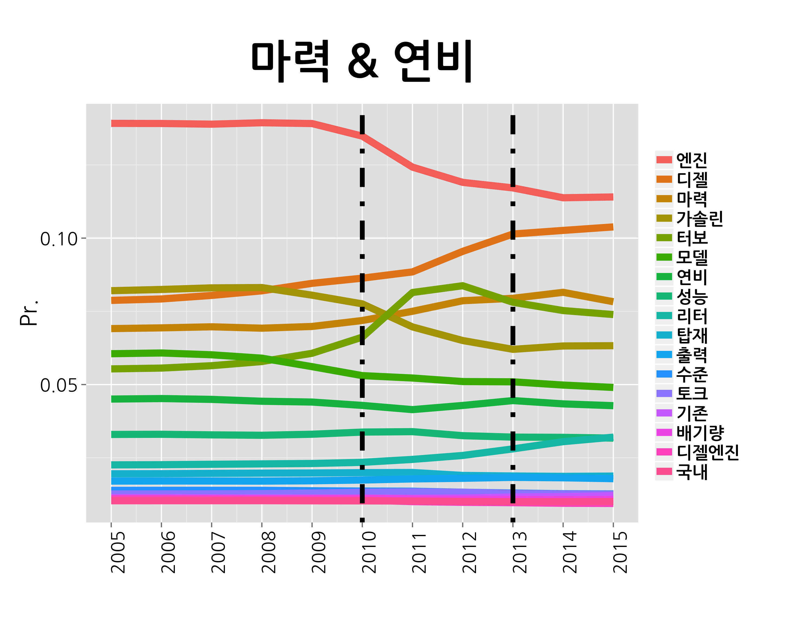</center>

*** =right

<center></center>

--- &twocol w1:50% w2:50% .new-background

## A차종의 불만 요인

*** =left

<center></center>

*** =right

<center>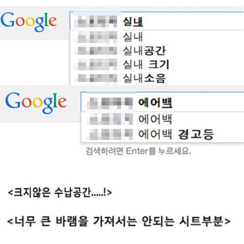</center>

--- .new-background

## Marginal Topic Distribution

<center></center>

--- .new-background

## Deep-Learning

<center>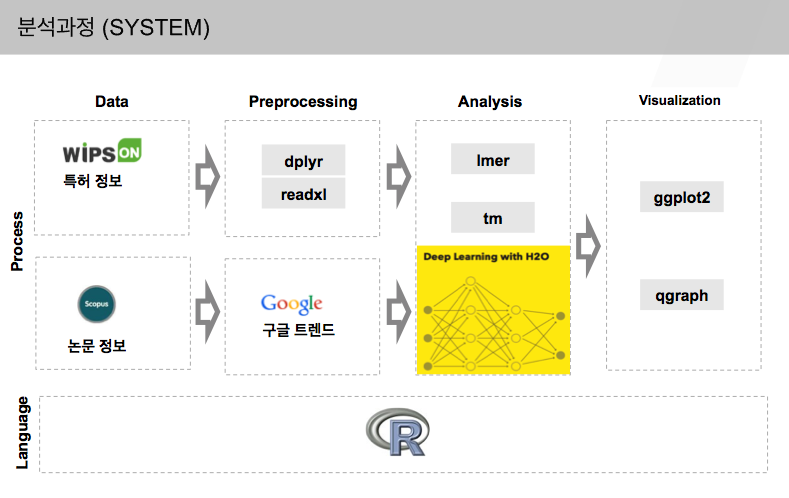</center>

--- .new-background

## Deep-Learning

<center>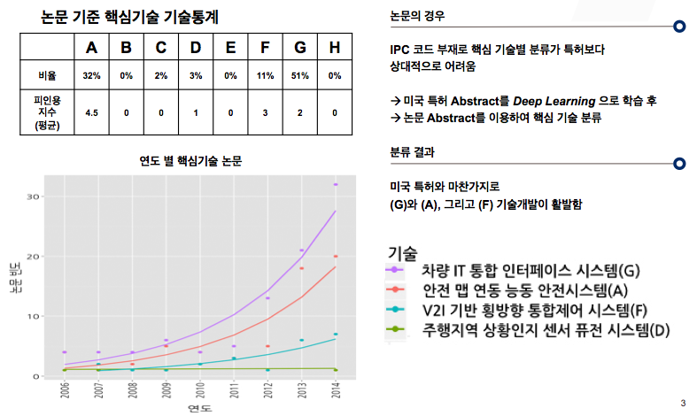</center>

--- &twocol w1:50% w2:50% .new-background

## 정리 

*** =left

### 감정 분석

<h4b> 사전 기반  </h4b>    
- Wordnet / Sentiwordnet  

<h4b> 주제에 따라 달라질 수 있는 감정 단어  </h4b>  
- 우리 어머니를 생각하면 <font color="red">안타까운</font> 마음이 크다  
- 분석을 망쳐서 <font color="blue">안타깝다  </font>

<h4b> 기계 학습 및 통계 모형 기반  </h4b>  
- 데이터가 많이 필요  
- 복잡한 모형은 구현이 어려움  

*** =right

### 그 외 이슈들

<h4b> 한국어 형태소 분석  </h4b>  

<h4b> 부정어 처리   </h4b>  
- 이중부정  

<h4b> 단어 순서 및 위치 처리    </h4b>  
- N-gram + LDA  
- Conditional Random Fields  
- Recursive Neural Network  
- Recurrent Neural Network  
- Convolution Neural Network  


--- &twocol w1:45% w2:55% .new-background

## 워크숍 관련 사이트

http://course.mindscale.kr/course/text-analysis

*** =left

<left></left>

*** =right

#### 텍스트 데이터 분석: 키워드를 넘어 토픽으로

<h4></br></h4>
<h4></br></h4>

<center>[온오프믹스 링크](http://onoffmix.com/event/48248)</center>

--- .dark .segue .nobackground

## 감사합니다