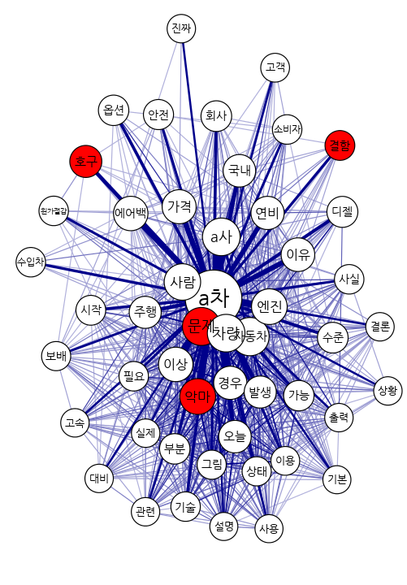
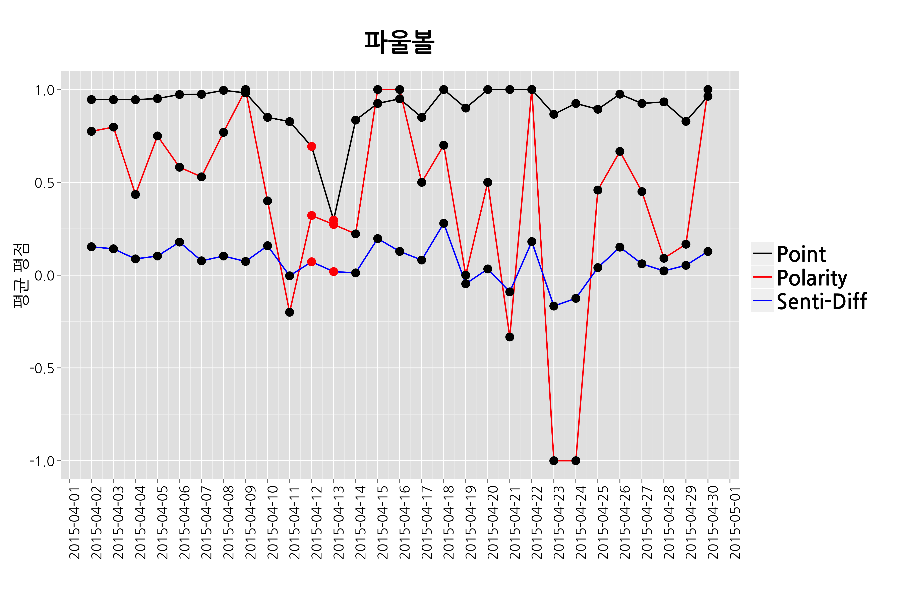
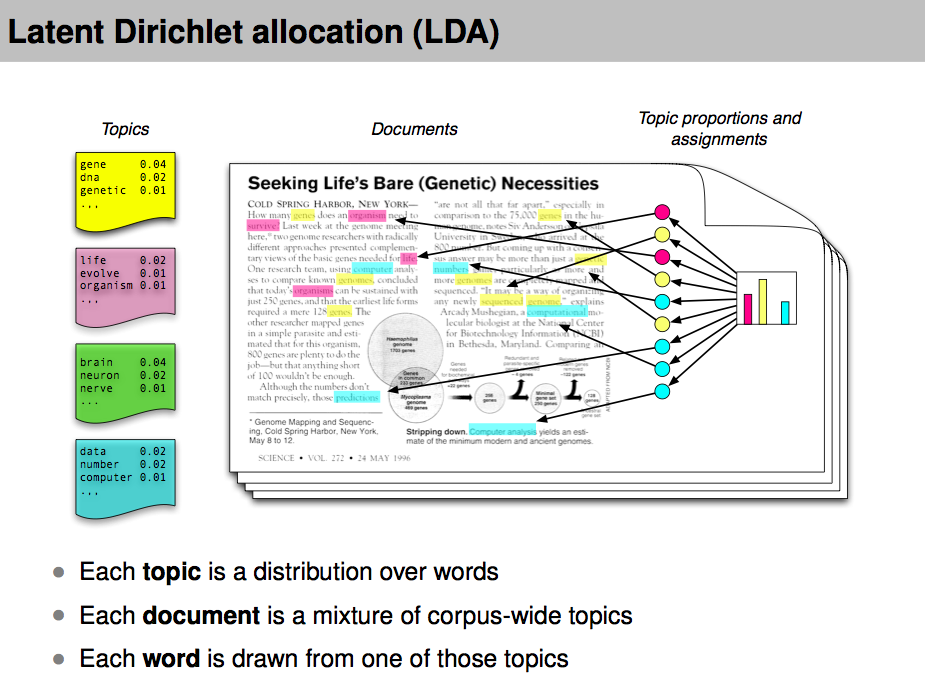
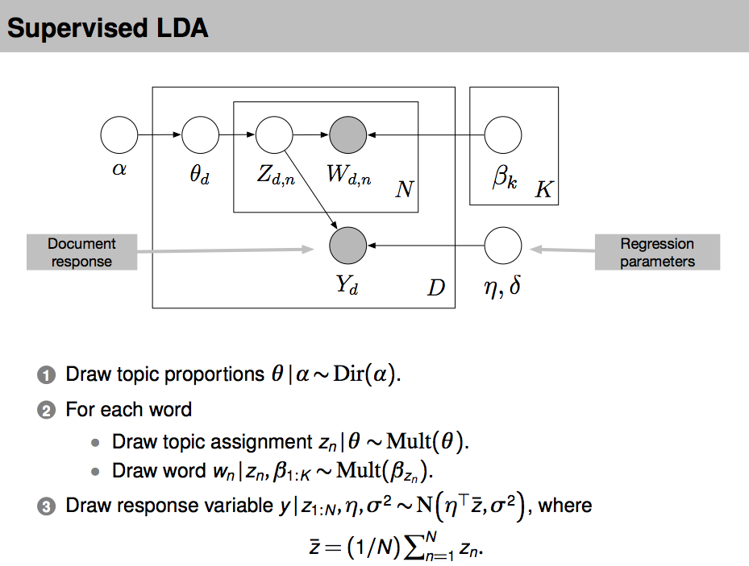
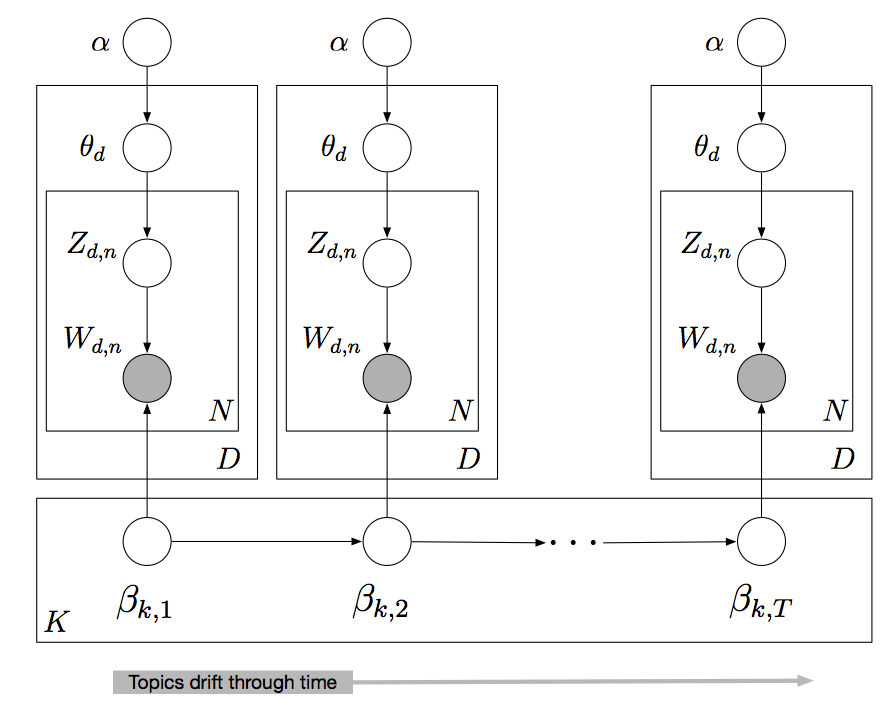
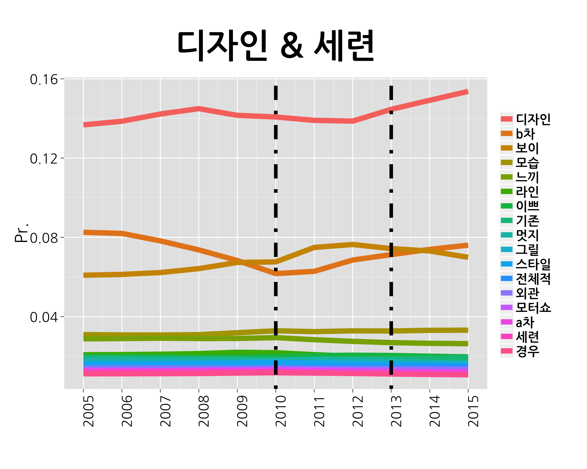
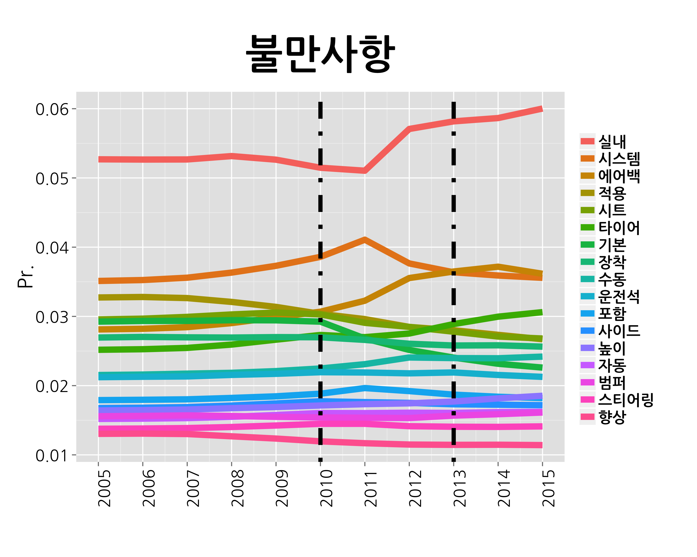
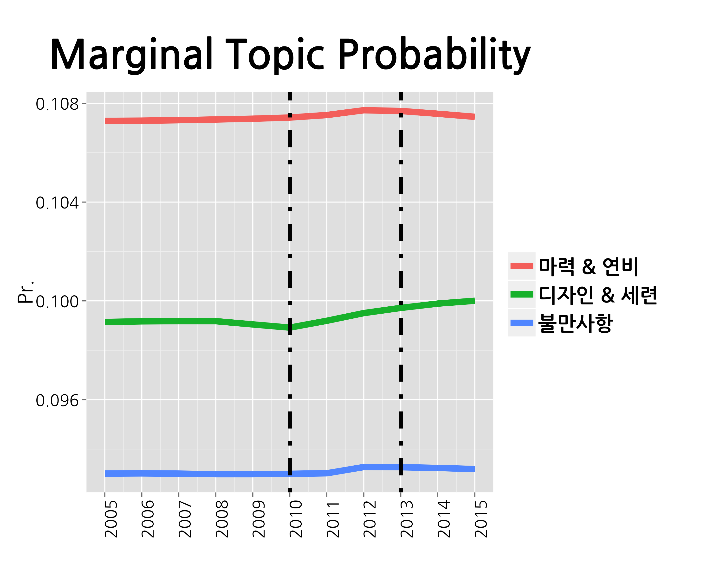

## 발표자 소개

- 김형준 (kim@mindscale.kr)
- 서울대학교 인류학 / 심리학 학사
- 서울대학교 인지과학 석사

### (현)
- (주)퀀트랩 Analytic Director  
- [온오프라인 R 교육](http://course.mindscale.kr/course/text-analysis)
- 기업 데이터 분석 및 컨설팅  

### (전)
- 품질 / 클레임 / 인사 데이터 분석  
- 홈페이지 및 서버 관리

--- .new-background

## 회사 소개

<center></center>

--- .new-background

## 나에게 R이란?

<h4></br></h4>
<h4></br></h4>

<h3b> 1. 통계 프로그램 : 모형화 / 예측  </h3b>  
<h3b> 2. 시각화 도구 : ggplot2 / Web과 연동 </h3b>     
<h3b> 3. 발표 자료 도구 : slidify   </h3b>  
<h3b> 4. 언어 처리 도구 : 텍스트 분석   </h3b>  
<h3b> 5. Matlab / Python -> R </h3b>  

- 본 발표자료는 Interactive Plots이 포함되어 있습니다. [클릭하세요](http://soeque1.github.io/RUCK2015/html/kim_quantlab.html#1)

--- .new-background

## 텍스트 분석

### 텍스트 분석 목적  
: 사람들은 생각과 감정을 언어로 표현합니다. 뉴스 댓글, 상품평, 커뮤니티, SNS 등에 사람들이 남기는 텍스트를 모아서 분석해보면 기존의 방법론으로 알기 어려웠던 여러 가지 정보를 얻을 수 있습니다.

### 감정 분석 목적
: 특정 키워드(이미지, 제품 등)에 대한 감정을 점수화하여 별도의 여론 조사 없이 감정의 정도를 예측할 수 있습니다. 또한, 감정의 이유를 분석하여 부정적인 요소를 개선할 수 있습니다.

### 통계 분석 목적 
: 주어진 데이터를 통해 미래를 예측 + 통계 모형을 통해 현상을 설명  

--- &twocol w1:40% w2:60% .new-background

## 분석 예시 - Text

*** =left

### 최초의 텍스트 분석

<h4></br></h4>

형태소 분석기  
- 형태소 분석기 KLT2000 (강승식)  

R  
- wordcloud  
- shiny  

결과
- 신축 기숙사 공용 공간 확대  
- 기존 기숙사 흡연 구역 재배정  

*** =right
<left></left>

--- &twocol w1:50% w2:50% .new-background

## 영화 이미테이션 게임 & 베네딕트 

*** =left
<center></center>

*** =right
<center></center>


--- &twocol w1:50% w2:50% .new-background

## 분석 예시 - Text

*** =left
<center></center>

*** =right
<center></center>

--- &twocol w1:50% w2:50% .new-background

## 텍스트와 감정

*** =left
<center></center>

*** =right

<h4></br></h4>
<h4></br></h4>


```r
library(KoNLP) 
library(tm)
library(qgraph)
```

한국어 감정사전  
불필요(stopwords) 단어사전  


```r
실망
```

```
## [1] "허접" "3d"   "4d"   "cg빨" "기대"
```

```r
지루
```

```
## [1] "초반" "산만" "전개" "감정" "전편"
```

--- &twocol w1:50% w2:50% .new-background

## 텍스트와 감정

*** =left

<center></center>

*** =right

<h4></br></h4>
<h4></br></h4>


```r
문제
```

 [1] "발생" "차량" "해결" "방향" "무관" "상태" "판단" "동일" "소음" "엔진"

```r
결함
```

 [1] "심각"     "리콜"     "기미"     "대형사고" "머플러"   "목숨"    
 [7] "앞바퀴"   "직관"     "확인"     "국토"    

--- &twocol w1:70% w2:30% .new-background

## 텍스트와 감정

*** =left

<div align="center">
<iframe width="1024" height="500"
src="http://soeque1.github.io/RUCK2015/html/assets/img/graph.html"  frameborder='0'>
    </iframe></div>

*** =right

<h4></br></h4>
<h4></br></h4>


```r
library(networkD3) 
```

--- .dark .segue .nobackground

## How?

--- .new-background

## 필요한 것 

### 형태소 분석 및 단어 파싱
- tm / tau / NLP / openNLP
- KoNLP 

### 감정사전 

- [tm.plugin.sentiment](http://statmath.wu.ac.at/courses/SNLP/Presentations/DA-Sentiment.pdf)
- http://mpqa.cs.pitt.edu/lexicons/subj_lexicon/
- http://word.snu.ac.kr/kosac/
- http://clab.snu.ac.kr/arssa/doku.php?id=app_dict_1.0
- www.openhangul.com

--- .new-background

<style>
italic {
   font-style: italic;
}
</style>

## 사전 만드는 법

<h4></br></h4>

Dragut, E. C., Yu, C., Sistla, P., & Meng, W. (2010).  
Construction of a sentimental word dictionary.  
<italic> Paper presented at the Proceedings of the 19th ACM international conference on Information and knowledge management. </italic>  

<h4></br></h4>
<h4></br></h4>

Rao, Y., Lei, J., Wenyin, L., Li, Q., & Chen, M. (2014).  
Building emotional dictionary for sentiment analysis of online news.  
<italic> World Wide Web </italic>, 17(4), 723-742.

--- .new-background

## Workflow

<center></center>

--- &twocol w1:50% w2:50% .new-background

## 감정 점수 (tm.plugin.sentiment)

*** =left
<center></center>

*** =right
<center></center>

--- .new-background

## 감정 점수

<center></center>

- [출처 : Mario Annau(2010)](http://statmath.wu.ac.at/courses/SNLP/Presentations/DA-Sentiment.pdf)

--- .new-background

## 감정 점수

<center></center>


--- .new-background

## 감정 점수

<center></center>

--- .new-background

## 감정 점수

<center></center>

--- .new-background

## 감정 점수

<center></center>

--- .new-background  .modal

## WHY?


```
##  [1] "한국야구의 진정한 발전을 위해서 이런 쉣같은 영감탱이의 우상화,신격화는 막아야....영감님 핥는 작자들은 내가 롯데팬이라고 뒤집어씌울듯...ㅉㅉ"                                                                                                            
##  [2] "성큰옹..선수는 그냥 소모품임? 실망..."                                                                                                                                                                                                                  
##  [3] "야신은 무슨 잘못도 인정 안하는 노망난 할배지"                                                                                                                                                                                                           
##  [4] "동걸이 인생은 내 알바아니지"                                                                                                                                                                                                                            
##  [5] "이동현 전병두 이승호 정대현 김성길 신윤호 김현욱 박정현 고효준 장문석 : 감독님 팔이 안올라가요 ㅠㅠ"                                                                                                                                                    
##  [6] "제목 틀렸습니다. 데드볼이라고 해야지 않나 시포요."                                                                                                                                                                                                      
##  [7] "독립구단에서도 연봉은 억대로 받으셨죠"                                                                                                                                                                                                                  
##  [8] "빈볼시키고 선수를 소모품처럼 버리고..."                                                                                                                                                                                                                 
##  [9] "빈볼이라쓰고실투라부른다"                                                                                                                                                                                                                               
## [10] "이동걸만 불쌍...."                                                                                                                                                                                                                                      
## [11] "빈볼왕101010010101"                                                                                                                                                                                                                                     
## [12] "영화가 얼마나 사람의 시야를 흐리게 만드는지 분명히 보여준다. 감성팔이를 하려면 최소한 감성이 있는 사람이 해야하지 않을까? 선수들을 인간적으로 생각하는 사람으로 이미지 메이킹을 하지만 실제 야구장에서는 정반대의 일이 벌어지니..정치를 했어도 잘했겠다"
## [13] "이만수 종신갓동니뮤ㅠ"                                                                                                                                                                                                                                  
## [14] "0점 왜 못주는거죠? 꼭 주고 싶습니다ㅠ"                                                                                                                                                                                                                  
## [15] "빈볼 던지라고 시켜놓고 자기는 안시켰다고 그 투수만 제구안되는 병신으로 만들어버리네."                                                                                                                                                                   
## [16] "인간의 탈을 쓴 더러운 양아치.야구의 신이 아니라야비의 신이게 딱 킬성근의 본모습.킬성근의 가식에 치가 떨린다."                                                                                                                                           
## [17] "미화 하나는 잘 시키는 역겨운 한국."                                                                                                                                                                                                                     
## [18] "파울볼? 김성근하면 역시 빈볼이지"                                                                                                                                                                                                                       
## [19] "추잡한 늙은이 야구계를 떠나라"                                                                                                                                                                                                                          
## [20] "야구계에서 사라지십쇼. 언제까지 그렇게 더러운 플레이로 팬들 눈살을 찌푸리게 하실 겁니까? 이게 한 두번이어야 그러려니 하지..SK 때부터 악질입니다 정말.. 뭐라고 사과의 메시지라도 보내고 받을 벌은 받아야 하는 거 아닙니까? 실망입니다 정말."             
## [21] "황재균을 향한 공이 두번 빗나가고 세번째 공을 던지려 들때 이동걸의 비참한 표정이 뇌리에 깊이 박혀 지워지지가 않는다. 33살의 무명이 4살어린 유명선수에게 비웃음을 당하는 그 기분. 그리고 출장금지 징계를 먹는다면 더이상1군으로 올라올수 없게 될테고"     
## [22] "당신이 추구하는 야구 어제 아주 잘 보았습니다 ^^  남 가르치기전에 자신부터 돌아보시길 ㅎㅎ"                                                                                                                                                              
## [23] "빈볼 더티야구 노답..."                                                                                                                                                                                                                                  
## [24] "이미지 세탁왕 제일교포 김성큰"                                                                                                                                                                                                                          
## [25] "롯데 좋아하기로 유명한 조진웅 나레이션이 그야말로 골계의 미"                                                                                                                                                                                            
## [26] "명장 같은소리하고 자빠졌네, 이기기위해선 선수들 선수생명  끊어져도 좋다는  식의감독은 명장이 아니다."                                                                                                                                                   
## [27] "제목 바꿔라 데드볼- 연속빈볼"                                                                                                                                                                                                                           
## [28] "감동적이었다고 한들.. 랭킹 1위를 할 만한 영화는 아님 다큐이지.. 미안해요"                                                                                                                                                                               
## [29] "오늘 데드볼때문에 이미지 다깎아내리시네. 앞으로 더럽게 야구하지 마세요"                                                                                                                                                                                 
## [30] "이딴 야구하면서 야신은 무슨 ㅋㅋㅋ"                                                                                                                                                                                                                     
## [31] "드러운노친네 빈볼날리니 좋아?"
```

---.new-background

<style>
italic {
   font-style: italic;
}
</style>

## Probabilistic Topic Models

### LDA  

Blei, David M. and Ng, Andrew and Jordan, Michael. (2003).  
Latent Dirichlet allocation.   
<italic>Journal of Machine Learning Research</italic>

[참고자료](http://yosinski.com/mlss12/media/slides/MLSS-2012-Blei-Probabilistic-Topic-Models.pdf)

---.new-background

## LDA

<center></center>

---.new-background

## LDA

<center></center>

---.new-background

## SLDA

<center></center>


--- &twocol w1:50% w2:50% .new-background

<style>
italic {
   font-style: italic;
}
</style>

## 대안

*** =left

### SLDA

Blei and McAuliffe, (2008).  
Supervised topic models.  
<italic> vances in Neural Information Processing Systems</italic>  
, pages 121–128. MIT Press.

### Cross-Validation

- Training Set과 Test Set을 7:3으로 분할


```r
library(lda)
library(topicmodels)
library(LDAvis)
library(servr)
```

*** =right

<h4></br></h4>
<h4></br></h4>

### 예측한 점수와 실제 점수간 상관관계


<!-- html table generated in R 3.1.3 by xtable 1.7-4 package -->
<!-- Sun Jun 21 22:11:03 2015 -->
<table border=1>
<tr> <th>  </th> <th> X </th> <th> test.point </th> <th> Polarity </th> <th> Senti.Diff </th> <th> slda </th>  </tr>
  <tr> <td align="right"> 1 </td> <td> test.point </td> <td align="right"> 1.00 </td> <td align="right"> 0.01 </td> <td align="right"> 0.07 </td> <td align="right"> 0.66 </td> </tr>
  <tr> <td align="right"> 2 </td> <td> Polarity </td> <td align="right"> 0.01 </td> <td align="right"> 1.00 </td> <td align="right"> 0.75 </td> <td align="right"> -0.01 </td> </tr>
  <tr> <td align="right"> 3 </td> <td> Senti-Diff </td> <td align="right"> 0.07 </td> <td align="right"> 0.75 </td> <td align="right"> 1.00 </td> <td align="right"> 0.05 </td> </tr>
  <tr> <td align="right"> 4 </td> <td> slda </td> <td align="right"> 0.66 </td> <td align="right"> -0.01 </td> <td align="right"> 0.05 </td> <td align="right"> 1.00 </td> </tr>
   </table>

--- .dark .segue .nobackground

## Graph

--- .new-background

<div align="center">
<iframe width="1024" height="500" src="http://soeque1.github.io/RUCK2015/html/assets/slda/foulball/index.html#topic=9&lambda=0.51&term="  frameborder="0"">
</iframe></div>

--- .new-background

<div align="center">
<iframe width="1024" height="500" src="http://soeque1.github.io/RUCK2015/html/assets/lda/bobe/index.html#topic=4&lambda=.5&term="  frameborder="0"">
</iframe></div>


--- .new-background

<div align="center">
<iframe width="1024" height="500" src="http://soeque1.github.io/RUCK2015/html/assets/lda/bobe/index.html#topic=15&lambda=.5&term="  frameborder="0"">
</iframe></div>

--- .new-background

<div align="center">
<iframe width="1024" height="500" src="http://soeque1.github.io/RUCK2015/html/assets/lda/bobe/index.html#topic=18&lambda=.5&term="  frameborder="0"">
</iframe></div>

--- .new-background

<style>
italic {
   font-style: italic;
}
</style>

## Dynamic Topic Model

<center></center>
  
<h4></br></h4>
  
Blei, D. M., & Lafferty, J. D. (2006)  
Dynamic topic models. <italic> In Proceedings of the 23rd international conference on Machine learning. </italic> ACM.

--- &twocol w1:50% w2:50% .new-background

## A차종의 장점 요인

*** =left

<center></center>

*** =right

<center></center>

--- &twocol w1:50% w2:50% .new-background

## A차종의 불만 요인

*** =left

<center></center>

*** =right

<center></center>

--- .new-background

## Marginal Topic Distribution

<center></center>

--- .new-background

## 워크숍 관련 온라인 사이트

http://course.mindscale.kr/course/text-analysis

<left></left>

--- .dark .segue .nobackground

## 감사합니다
