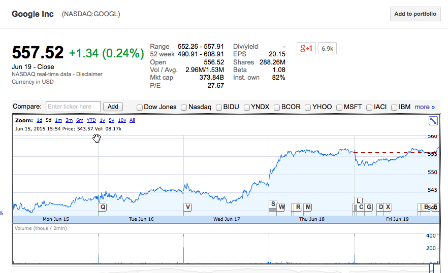
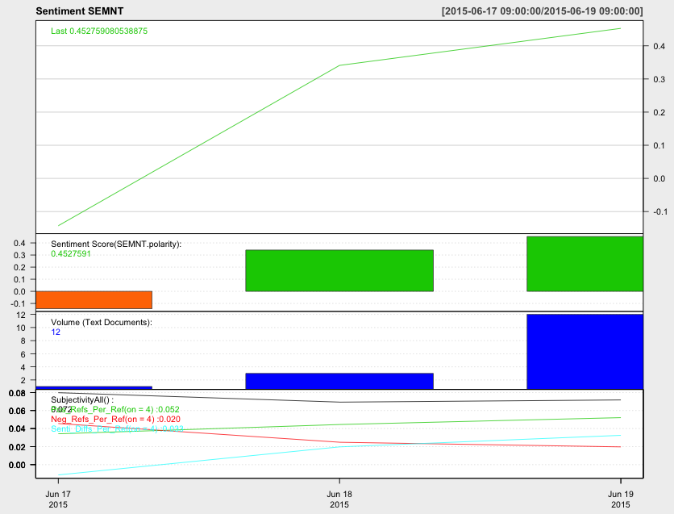

## Introduction

--- .new-background

### R

### 통계 프로그램 : 모형화 / 예측  
### 시각화 도구 : ggplot2 / Web과 연동  
### 언어 처리(?) : 텍스트 분석  

--- .new-background

## 텍스트 분석

### 텍스트 분석 목적  
: 사람들은 생각과 감정을 언어로 표현합니다. 뉴스 댓글, 상품평, 커뮤니티, SNS 등에 사람들이 남기는 텍스트를 모아서 분석해보면 기존의 방법론으로 알기 어려웠던 여러 가지 정보를 얻을 수 있습니다.

### 감정 분석 목적
: 특정 키워드(이미지, 제품 등)에 대한 감정을 점수화하여 별도의 여론 조사 없이 감정의 정도를 예측할 수 있습니다. 또한, 감정의 이유를 분석하여 부정적인 요소를 개선할 수 있습니다.

--- &twocol w1:50% w2:50% .new-background

## 분석 예시 - Text

*** =left

*** =right

--- .new-background

## 분석 예시 - Self-Rating & Text

--- &twocol w1:50% w2:50% .new-background

## R과 감정 분석

*** =left

*** =right

--- .dark .segue .nobackground

## How?

--- .new-background

## 필요한 것 

### 형태소 분석 및 단어 파싱
- tm / tau / NLP / openNLP
- KoNLP 

### 감정사전 
- tm.plugin.sentiment
- http://mpqa.cs.pitt.edu/lexicons/subj_lexicon/
- http://word.snu.ac.kr/kosac/
- http://clab.snu.ac.kr/arssa/doku.php?id=app_dict_1.0
- www.openhangul.com

--- .new-background

## 사전 만드는 법

### 1. Web - Crwaling  
### 2. Y(문서별 점수) ~ X(문서 * 단어)  
### 3.1. Seed Word 활용  
### 3.2. Models : SVM, Deep-Learning, GLM 등  

--- .new-background

<iframe width="1024" height="640"
src="http://soeque1.github.io/RUCK2015/html/assets/img/graph.html"  frameborder='0'>
    </iframe>

---

<iframe width="1024" height="640"
src="http://soeque1.github.io/RUCK2015/html/assets/vis/index.html#topic=9&lambda=1&term="  frameborder="0"">
    </iframe>

--- .new-background

## 워크숍 관련 온라인 사이트

http://course.mindscale.kr/course/text-analysis

<left></left>

